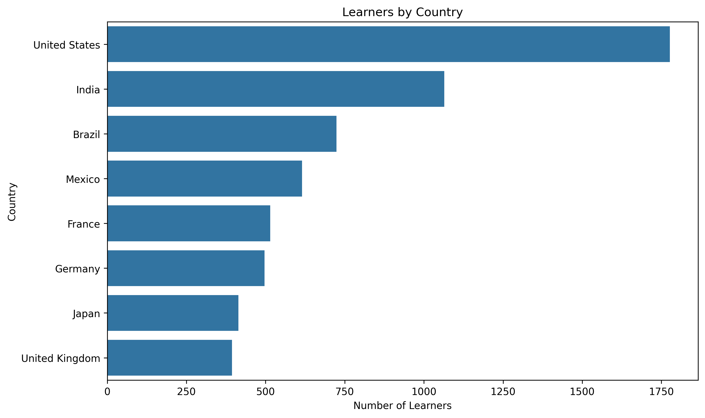
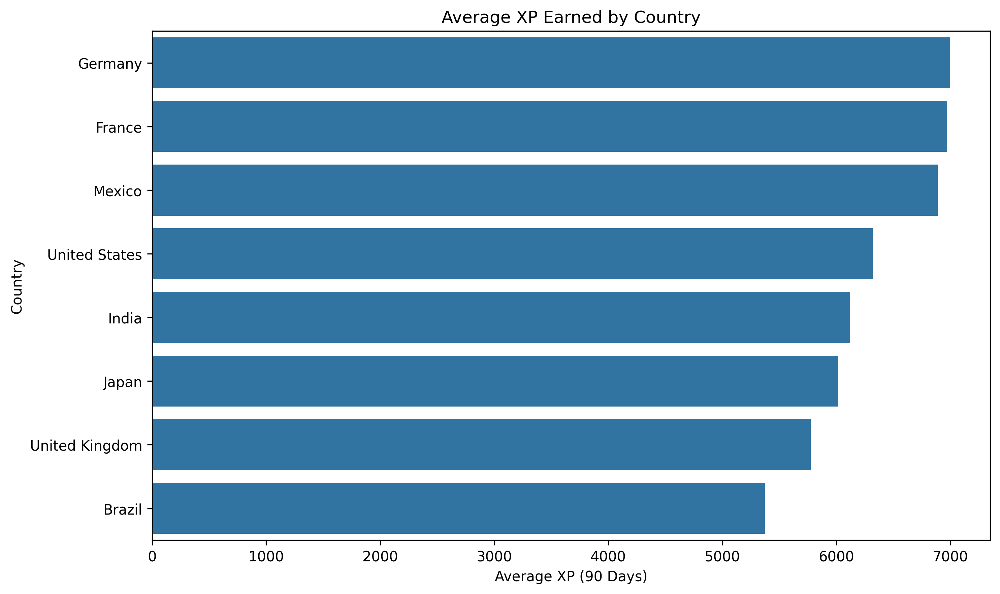
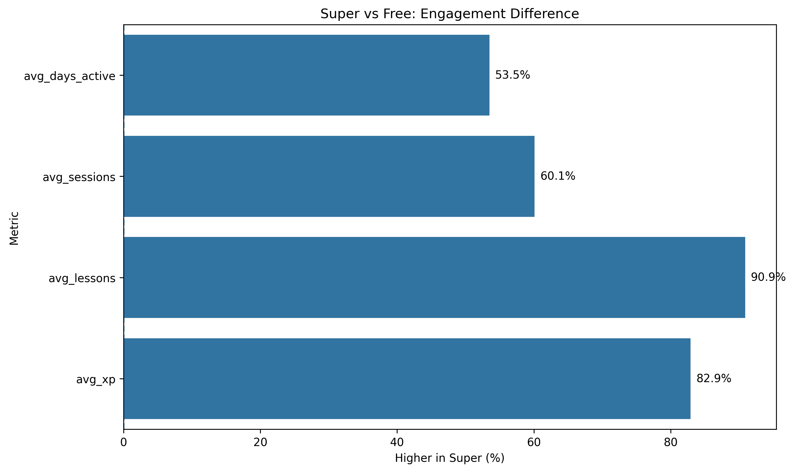
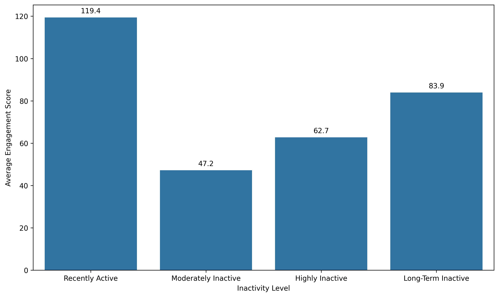
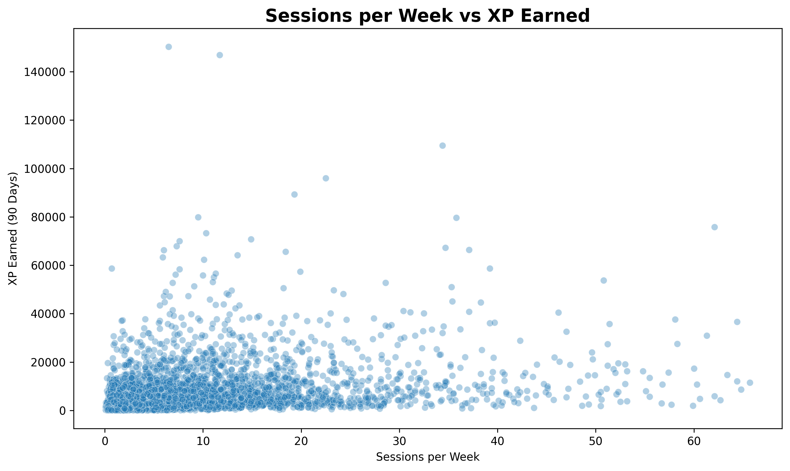
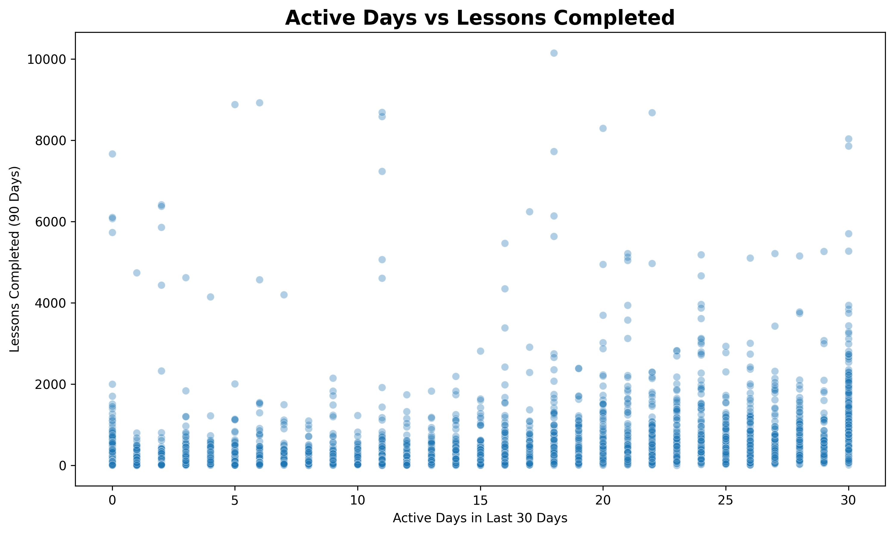
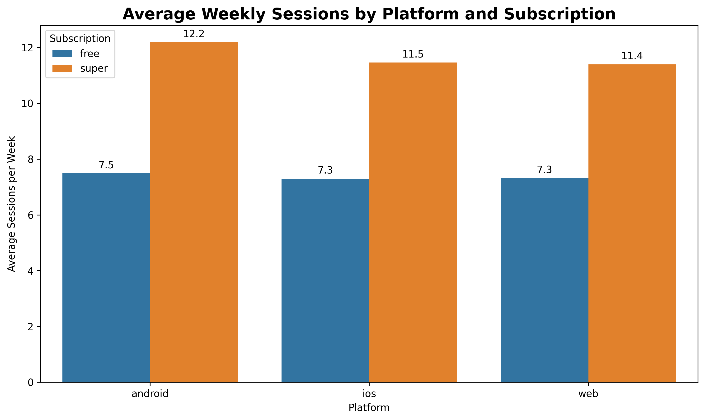

# Duolingo Learner Engagement & Inactivity Analysis

## Project Overview

This project analyzes 6,000 Duolingo learner records to understand learner engagement, inactivity, subscription behavior, platform usage, and learner segments.

The analysis was performed using Python and focuses on descriptive and diagnostic analytics.

## Business Questions

- How does learner engagement vary by subscription type?
- Which countries show higher learner activity?
- How does learner activity differ across platforms?
- What patterns are associated with learner inactivity?
- Can learners be grouped into meaningful engagement segments?

## Tools & Technologies

- Python
- Pandas
- NumPy
- Matplotlib
- Seaborn
- Jupyter Notebook

## Project Workflow

1. Data Loading
2. Data Inspection
3. Data Quality Assessment
4. Data Cleaning
5. Exploratory Data Analysis
6. Feature Engineering
7. Engagement & Inactivity Analysis
8. Data Visualization
9. Learner Segmentation
10. Key Findings
11. Business Recommendations

## Data Cleaning

The dataset contained 6,000 learner records and 18 columns.

There were 93 missing values in `avg_session_minutes`. These missing values were handled using median imputation.

After cleaning, the dataset contained no missing values or duplicate records.

## Feature Engineering

The following analytical features were created:

- `user_engagement_score`
- `inactivity_level`
- `session_intensity`
- `learner_segment`

The engagement score is a project-created composite index used for exploratory analysis and segmentation. It is not an official Duolingo KPI.

## Learner Segmentation

Learners were grouped into four segments:

- At Risk / Inactive
- Occasionally Engaged
- Regularly Engaged
- Highly Engaged

## Key Findings

- Super subscribers show substantially higher engagement than Free learners across active days, weekly sessions, lessons completed, and XP earned.
- Almost half of the learners belong to the Occasionally Engaged segment.
- Highly Engaged learners show consistently stronger learning activity.
- At Risk / Inactive learners still have meaningful historical learning activity.
- Engagement levels are broadly similar across Android, iOS, and Web platforms.
- Learner activity varies across countries.
- Active days and lesson completion show a weak positive relationship.

## Business Recommendations

- Focus on improving engagement among Occasionally Engaged learners.
- Investigate re-engagement opportunities for inactive learners.
- Further investigate the relationship between subscription and engagement.
- Avoid relying on notification status alone to improve engagement.
- Explore market-specific learner behavior for localized strategies.

## Limitations

- The analysis is observational and does not establish causation.
- The engagement score is a custom analytical metric.
- The learner segments are rule-based and created for this project.
- The dataset does not contain a true retention or churn outcome.
- Extreme values were investigated but not automatically removed because they may represent valid learner behavior.

## Conclusion

This project demonstrates an end-to-end data analytics workflow using Python, from data cleaning and exploratory analysis to feature engineering, segmentation, visualization, and business recommendations.

## Project Visualizations

### Learners by Country

### Average XP by Country

### Subscription Engagement Comparison

### Engagement Across Inactivity Levels

### Sessions per Week vs XP

### Active Days vs Lessons Completed

### Learner Activity Distribution

### Platform and Subscription Comparison

